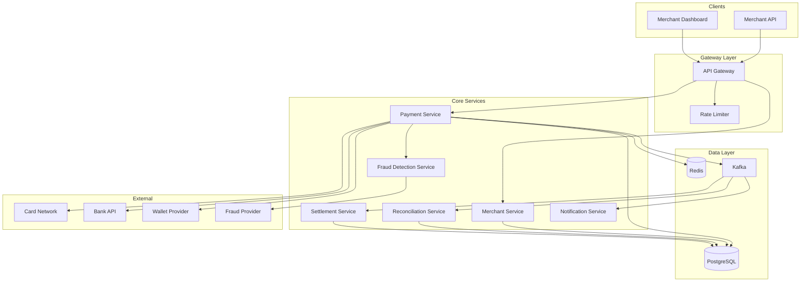

# Product TSD - NexaPay Payment Platform

| Document Information | |
|----------------------|------------------------------------------------|
| Document Name | Product Technical Solution Design |
| Product | NexaPay Payment Platform |
| Version | 1.0 |
| Status | Approved |
| Author | Solution Architecture Team |
| Reviewer | Enterprise Architecture Board |
| Approver | Chief Architect |
| Classification | Internal |
| Last Updated | 2024-11-15 |

---

# 1. Purpose

## Description

This Product TSD defines the long-term technical architecture of the NexaPay Payment Platform.

NexaPay is an enterprise payment processing platform that enables merchants to accept, process, and reconcile digital payments across multiple channels and payment methods.

This document serves as the authoritative technical baseline for all future projects that modify or extend the platform.

---

# 2. Objectives

- Describe the overall product architecture of NexaPay.
- Establish the technical baseline for payment processing.
- Align NexaPay with Enterprise Architecture.
- Standardize engineering decisions.
- Document product capabilities.
- Define integration boundaries.
- Support future enhancements.
- Guide solution design.
- Support operational readiness.

---

# 3. Audience

| Role | Responsibility |
|------|----------------|
| Enterprise Architect | Architecture governance |
| Solution Architect | Solution ownership |
| Product Owner | Product vision |
| Engineering Manager | Engineering governance |
| Technical Lead | Technical ownership |
| Developer | Product understanding |
| QA | Functional understanding |
| DevOps | Deployment architecture |
| IT Operations | Operational support |
| Security | Security governance |

---

# 4. Product Overview

NexaPay operates in the **financial services** domain, providing **digital payment processing** capabilities.

**Business Capabilities:**

- Payment initiation and processing
- Merchant management
- Transaction reconciliation
- Settlement processing
- Fraud detection
- Reporting and analytics

**Primary Users:**

- Merchants (B2B)
- End consumers (B2C via merchant integration)
- Operations team (internal)

**Business Value:**

- Enable digital revenue streams for merchants
- Reduce transaction processing costs
- Ensure regulatory compliance
- Provide real-time payment visibility

---

# 5. Product Scope

## In Scope

- Payment processing (cards, bank transfers, digital wallets)
- Merchant onboarding and management
- Transaction reconciliation
- Settlement processing
- Fraud detection (basic)
- Merchant dashboard
- Reporting APIs

## Out of Scope

- Card issuing
- Cryptocurrency processing
- Lending products
- KYC/AML (leveraging external provider)

---

# 6. Business Capabilities

| Capability | Description | Criticality |
|------------|-------------|-------------|
| Payment Processing | Initiate, authorize, capture, refund | Mission Critical |
| Merchant Management | Onboarding, configuration, lifecycle | Business Critical |
| Reconciliation | Match transactions across systems | Business Critical |
| Settlement | Merchant fund disbursement | Mission Critical |
| Fraud Detection | Real-time risk assessment | Business Critical |
| Reporting | Transaction and settlement reports | Standard |

---

# 7. Enterprise Architecture Alignment

| EA Domain | Alignment |
|-----------|-----------|
| Business Architecture | Supports digital payment business capability |
| Application Architecture | Microservices architecture, event-driven |
| Data Architecture | Transactional data in PostgreSQL, events in Kafka |
| Technology Architecture | Cloud-native, Kubernetes, managed services |
| Security Architecture | PCI-DSS compliant, OAuth 2.1, encryption at rest and in transit |

---

# 8. Product Architecture

---

# 9. Application Landscape

| System | Interaction | Direction | Protocol |
|---------|-------------|-----------|----------|
| Card Network (Visa/MC) | Payment authorization | Outbound | REST |
| Bank API | Bank transfers | Outbound | REST |
| Wallet Provider | Digital wallet payments | Outbound | REST |
| Fraud Provider | Risk scoring | Outbound | REST |
| Merchant POS | Payment initiation | Inbound | REST |
| Mobile SDK | Payment initiation | Inbound | REST |
| Internal Reporting | Transaction data | Inbound | Kafka |

---

# 10. Domain Model

| Domain | Aggregate | Key Entities |
|--------|-----------|-------------|
| Payment | Transaction | Transaction, Authorization, Capture, Refund |
| Merchant | Merchant | Merchant, Configuration, Credential |
| Reconciliation | Reconciliation | ReconciliationRecord, Discrepancy |
| Settlement | Settlement | SettlementBatch, Disbursement |
| Fraud | RiskAssessment | RiskScore, Rule, Alert |

---

# 11. Component Catalog

| Component | Responsibility | Technology | Deployment |
|-----------|---------------|------------|------------|
| API Gateway | Request routing, rate limiting | Kong | Kubernetes |
| Payment Service | Payment orchestration | Java/Spring Boot | Kubernetes |
| Merchant Service | Merchant lifecycle | Java/Spring Boot | Kubernetes |
| Reconciliation Service | Transaction matching | Python | Kubernetes |
| Settlement Service | Fund disbursement | Java/Spring Boot | Kubernetes |
| Fraud Detection | Risk scoring | Python/ML | Kubernetes |
| Notification Service | Event notifications | Node.js | Kubernetes |

---

# 12. API Landscape

| API | Type | Authentication | Versioning |
|-----|------|----------------|------------|
| Payment API | Public (Merchant) | OAuth 2.1 + mTLS | URI (`/api/v1/`) |
| Merchant API | Internal | OAuth 2.1 | URI (`/api/v1/`) |
| Reconciliation API | Internal | Service-to-service | URI (`/api/v1/`) |
| Settlement API | Internal | Service-to-service | URI (`/api/v1/`) |
| Reporting API | Partner | OAuth 2.1 | URI (`/api/v1/`) |

Reference: ../architecture/api-design-standard.md

---

# 13. Data Architecture

| Data Domain | Storage | Retention |
|-------------|---------|-----------|
| Transaction data | PostgreSQL | 7 years |
| Merchant data | PostgreSQL | 7 years |
| Reconciliation data | PostgreSQL | 7 years |
| Audit logs | PostgreSQL | 7 years |
| Session data | Redis | 24 hours |
| Events | Kafka | 30 days |
| Reporting | Data warehouse | 7 years |

Reference: ../architecture/database-design-standard.md

---

# 14. Integration Architecture

| Integration | Protocol | Direction | Reliability |
|-------------|----------|-----------|-------------|
| Card Network | REST | Outbound | Critical |
| Bank API | REST | Outbound | Critical |
| Wallet Provider | REST | Outbound | Critical |
| Fraud Provider | REST | Outbound | High |

Reference: ../architecture/integration-standard.md

---

# 15. Security Architecture

| Control | Implementation |
|---------|---------------|
| Authentication | OAuth 2.1 + OpenID Connect |
| Authorization | RBAC + Scope-based |
| Encryption in Transit | TLS 1.3 |
| Encryption at Rest | AES-256 |
| Secrets Management | HashiCorp Vault |
| Audit Logging | All state changes logged |
| PCI-DSS | Level 1 compliance |
| Penetration Testing | Annual |

Reference: ../architecture/security-standard.md

---

# 16. Technology Stack

| Layer | Technology |
|--------|------------|
| Frontend | React (Merchant Dashboard) |
| Backend | Java 21 / Spring Boot |
| API Gateway | Kong |
| Database | PostgreSQL 16 |
| Cache | Redis 7 |
| Messaging | Apache Kafka 3.x |
| Container | Kubernetes (EKS) |
| CI/CD | GitHub Actions |
| Monitoring | Datadog |
| Logging | ELK Stack |
| Tracing | OpenTelemetry / Jaeger |

---

# 17. Non-Functional Requirements

| Category | Target |
|----------|--------|
| Availability | 99.99% |
| Performance (P95) | < 200ms |
| Performance (P99) | < 500ms |
| Scalability | 10,000 TPS |
| RPO | 0 (zero data loss) |
| RTO | < 15 minutes |
| Concurrent Users | 100,000 |

Reference: ../architecture/non-functional-requirements.md

---

# 18. Operational Architecture

| Component | Tool |
|-----------|------|
| Monitoring | Datadog |
| Logging | ELK Stack |
| Tracing | OpenTelemetry |
| Alerting | PagerDuty |
| Incident Management | PagerDuty + Slack |

Reference: ../operations/operational-runbook.md

---

# 19. Deployment Architecture

- Multi-AZ deployment on AWS EKS
- Blue/Green deployment strategy
- Database with Multi-AZ replication
- Redis Cluster with failover
- Kafka with 3-broker cluster
- CDN for static assets

---

# 20. Product Roadmap

| Quarter | Initiative |
|---------|-----------|
| Q1 2025 | Real-time fraud detection upgrade |
| Q2 2025 | Merchant analytics dashboard |
| Q3 2025 | International payment support |
| Q4 2025 | Open banking integration |

---

# 21. Architecture Decision References

| ADR | Title | Status |
|-----|-------|--------|
| ADR-001 | Adopt PostgreSQL as Primary Database | Accepted |
| ADR-002 | Use Kafka for Event Streaming | Accepted |
| ADR-003 | Implement OAuth 2.1 with OpenID Connect | Accepted |
| ADR-004 | Adopt Kubernetes as Deployment Platform | Accepted |

---

# 22. Related Projects

| Project | Version | Status |
|----------|---------|--------|
| NexaPay v1.0 | 1.0 | Released |
| NexaPay Fraud Detection | 1.1 | In Development |

---

# 23. Known Technical Debt

| Item | Impact | Priority | Planned Resolution |
|------|--------|----------|-------------------|
| Legacy reconciliation batch job | Performance | High | Q1 2025 |
| Hardcoded retry values | Maintainability | Medium | Q2 2025 |
