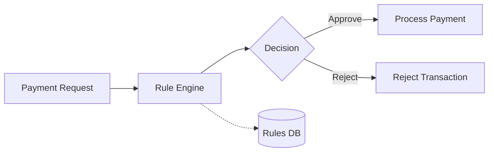
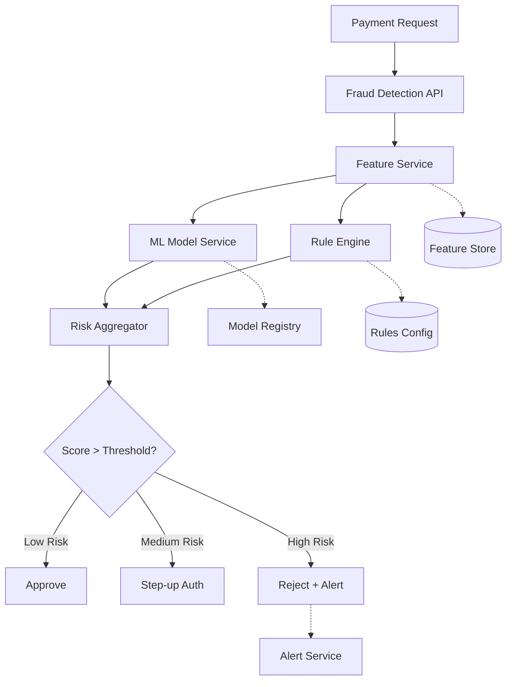

# Project TSD - NexaPay Fraud Detection Enhancement

| Document Information | |
|----------------------|------------------------------------------------|
| Document Name | Technical Solution Design |
| Project | Fraud Detection Enhancement |
| Product | NexaPay Payment Platform |
| Project Code | NEXAFD-2024 |
| Version | 1.0 |
| Status | Approved |
| Author | Solution Architecture Team |
| Reviewer | Enterprise Architecture Board |
| Approver | Chief Architect |
| Classification | Internal |
| Last Updated | 2024-10-20 |

---

# 1. Purpose

## Description

This Technical Solution Design documents the implementation of an enhanced real-time fraud detection capability for the NexaPay Payment Platform.

The current fraud detection relies on basic rule-based checks. This project introduces ML-based risk scoring with real-time evaluation, reducing fraud losses while minimizing false positives.

---

# 2. Objectives

- Implement ML-based real-time fraud scoring.
- Reduce false positive rate by 40%.
- Maintain < 50ms added latency for payment authorization.
- Support configurable risk rules.
- Enable real-time alerting for high-risk transactions.

---

# 3. Audience

| Role | Responsibility |
|------|----------------|
| Product Owner | Business validation |
| Solution Architect | Solution approval |
| Enterprise Architect | Architecture governance |
| Technical Lead | Technical review |
| Developer | Implementation |
| QA | Testing |
| DevOps | Deployment |
| Operations | Operational support |

---

# 4. References

| Document | Reference |
|----------|-----------|
| Product TSD | ../examples/sample-product/product-tsd.md |
| Enterprise Architecture Principles | Internal |
| API Design Standard | ../architecture/api-design-standard.md |
| Security Standard | ../architecture/security-standard.md |

---

# 5. Business Background

Fraud losses increased 25% in Q3 2024. The current rule-based system cannot adapt to new fraud patterns quickly enough. The business requires:

- Real-time ML-based risk scoring
- Faster adaptation to new fraud patterns
- Reduced false positives (currently 15% of legitimate transactions declined)
- Lower fraud losses (target: 50% reduction)

---

# 6. Business Requirement Summary

| ID | Requirement | Priority | Acceptance Criteria |
|----|-------------|----------|---------------------|
| BR-001 | Real-time fraud scoring | High | < 50ms latency |
| BR-002 | Configurable risk rules | High | Business can update rules |
| BR-003 | Reduced false positives | High | < 8% false positive rate |
| BR-004 | Real-time alerts | Medium | Alert within 1 minute |
| BR-005 | Fraud dashboard | Medium | Real-time fraud metrics |

---

# 7. Scope

## In Scope

- ML model deployment for risk scoring
- Feature engineering pipeline
- Real-time scoring API
- Rule engine integration
- Alert service
- Fraud dashboard

## Out of Scope

- Historical fraud analysis platform
- Customer-facing fraud notifications
- Manual review workflow (future project)

## Assumptions

- Existing Kafka infrastructure is available
- ML model is pre-trained by Data Science team
- Current payment flow supports synchronous fraud check
- GPU infrastructure available for model serving

## Constraints

- Must not increase payment latency by more than 50ms
- Must comply with PCI-DSS requirements
- Must support 10,000 TPS

---

# 8. Current State (As-Is)

The current fraud detection is a simple rule engine embedded in the Payment Service:



**Limitations:**

- 15% false positive rate
- Rules require code changes and deployment
- No ML-based scoring
- No real-time alerting
- Limited adaptability to new patterns

---

# 9. Proposed Solution (To-Be)



**Key Design Decisions:**

- ML model served via dedicated model service
- Feature computation in-memory (Redis)
- Risk aggregation combines ML score + rule scores
- Three-tier decision: approve, step-up, reject
- Async alerting (non-blocking)

---

# 10. Architecture Alignment

| EA Domain | Alignment |
|-----------|-----------|
| Business Architecture | Supports fraud prevention business capability |
| Application Architecture | New microservice, event-driven patterns |
| Data Architecture | Feature store in Redis, scoring logs in PostgreSQL |
| Technology Architecture | ML model serving on Kubernetes |
| Security Architecture | OAuth 2.1, mTLS, PCI-DSS compliant |

---

# 11. Impact Analysis

| Area | Impact | Description | Owner |
|------|--------|-------------|-------|
| API | High | New Fraud Detection API endpoint | Tech Lead |
| Database | Medium | New tables for scoring logs | DBA |
| Infrastructure | High | GPU nodes for model serving | DevOps |
| Monitoring | High | New dashboards and alerts | SRE |
| Security | Medium | New service authentication | Security |
| Operations | High | New runbook and procedures | Operations |

---

# 12. Component Changes

| Component | Change | Reason |
|-----------|--------|--------|
| Payment Service | Call Fraud Detection API | Integration with new service |
| Fraud Detection Service | New service | ML-based fraud scoring |
| Feature Service | New service | Real-time feature computation |
| Alert Service | New service | Real-time fraud alerts |

---

# 13. API Changes

### New: POST /api/v1/fraud/score

| Field | Value |
|-------|-------|
| Authentication | mTLS + OAuth 2.1 |
| Authorization | Payment Service only |
| Request | Transaction details |
| Response | Risk score, decision, reasons |
| Timeout | 30ms |
| Rate Limit | 10,000 TPS |

---

# 14. Database Changes

| Change | Type | Description |
|--------|------|-------------|
| fraud_scoring_log | New Table | Log every fraud scoring request |
| fraud_alerts | New Table | Store fraud alerts |
| risk_rules | New Table | Configurable risk rules |

Reference: ../architecture/database-design-standard.md

---

# 15. Integration Changes

| Integration | Type | Description |
|-------------|------|-------------|
| ML Model Service | Internal REST | Risk scoring |
| Feature Store (Redis) | Internal | Feature retrieval |
| Alert Service | Internal Kafka | Async alert delivery |

---

# 16. Configuration Changes

| Change | Type | Description |
|--------|------|-------------|
| FRAUD_API_TIMEOUT | Env Var | 30ms timeout |
| FRAUD_SCORE_THRESHOLD | ConfigMap | Risk threshold values |
| ML_MODEL_VERSION | ConfigMap | Active model version |

---

# 17. Security Assessment

| Area | Implementation |
|------|---------------|
| Authentication | mTLS service-to-service |
| Authorization | Scope-based (payment:write) |
| Sensitive Data | Transaction amounts masked in logs |
| Secrets | Model API key in Vault |
| Audit | All scoring decisions logged |

---

# 18. Non-Functional Requirements

| Category | Target |
|----------|--------|
| Availability | 99.99% |
| Latency (P95) | < 30ms |
| Latency (P99) | < 50ms |
| Throughput | 10,000 TPS |
| Scalability | Horizontal auto-scaling |

---

# 19. Testing Strategy

| Test Type | Scope |
|-----------|-------|
| Unit Test | Feature computation, scoring logic |
| Integration Test | API integration, model serving |
| Performance Test | 10,000 TPS load test |
| Accuracy Test | Model precision/recall validation |
| Failover Test | Model service failover |

---

# 20. Release Management

## Environment Promotion

```text
DEV → SIT → UAT → PREPROD → PROD
```

## Rollback Strategy

- Disable Fraud Detection API call in Payment Service
- Revert to legacy rule engine
- Feature flag controlled

## Release Checklist

- [x] Architecture Approved
- [ ] CAB Approved
- [ ] QA Approved
- [ ] Security Approved
- [ ] Operations Ready
- [ ] Monitoring Ready

---

# 21. Operational Readiness

| Item | Status |
|------|--------|
| Dashboard | In Progress |
| Monitoring | In Progress |
| Alerting | In Progress |
| Runbook | Planned |
| Escalation | Defined |

---

# 22. Risks & Dependencies

| Risk | Impact | Mitigation | Owner |
|------|--------|------------|-------|
| Model accuracy below target | High | A/B testing, rule fallback | Data Science |
| Latency exceeds 50ms | High | Caching, async features | Tech Lead |
| GPU availability | Medium | Pre-provisioned capacity | DevOps |

---

# 23. Acceptance Criteria

- [ ] Fraud scoring latency < 50ms (P99)
- [ ] False positive rate < 8%
- [ ] 10,000 TPS sustained
- [ ] All unit tests passing
- [ ] Performance test passed
- [ ] Security review completed
- [ ] Runbook complete
