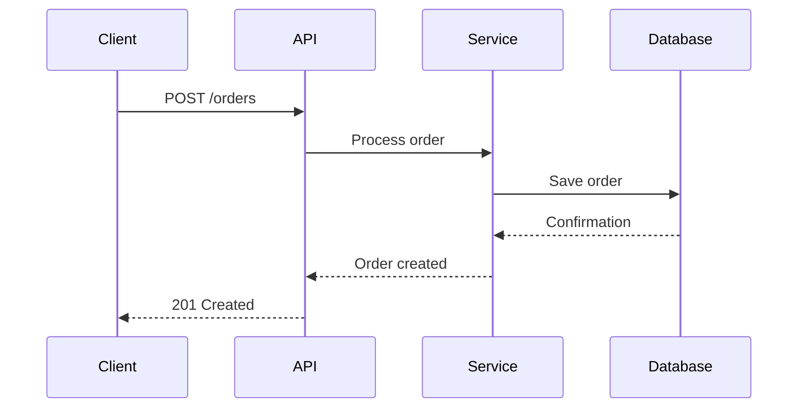
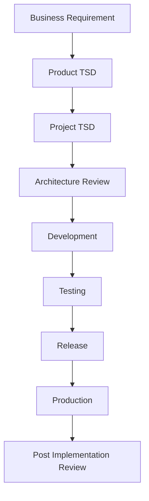
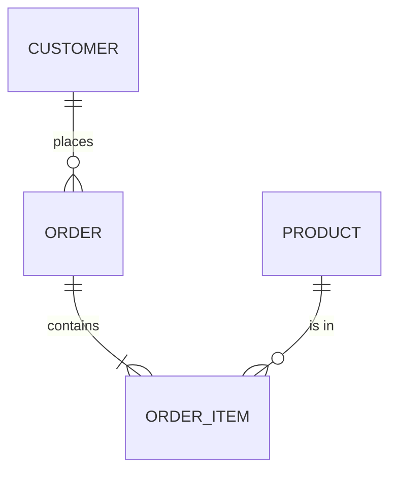

# Mermaid Templates

This directory contains Mermaid template files for architecture diagrams.

---

## Available Templates

| Template | Description | File |
|----------|-------------|------|
| Context Diagram | System context diagram | context-diagram.mmd |
| Container Diagram | High-level container view | container-diagram.mmd |
| Component Diagram | Component-level design | component-diagram.mmd |
| Sequence Diagram | Interaction flow | sequence-diagram.mmd |
| Flowchart | Process flow | flowchart.mmd |
| ERD | Entity-relationship diagram | erd.mmd |
| State Diagram | State machine | state-diagram.mmd |
| Gantt Chart | Timeline / project plan | gantt.mmd |

---

## Usage

1. Use Mermaid Live Editor (https://mermaid.live) or VS Code extension
2. Modify the template for your project
3. Render the diagram
4. Store the source `.mmd` file in your project repository

---

## Mermaid Examples

### Sequence Diagram

### Flowchart

### ERD

---

## Best Practices

- Use descriptive node IDs.
- Keep diagrams focused.
- Use consistent styling.
- Update diagrams when the architecture changes.
- Render and verify before committing.
